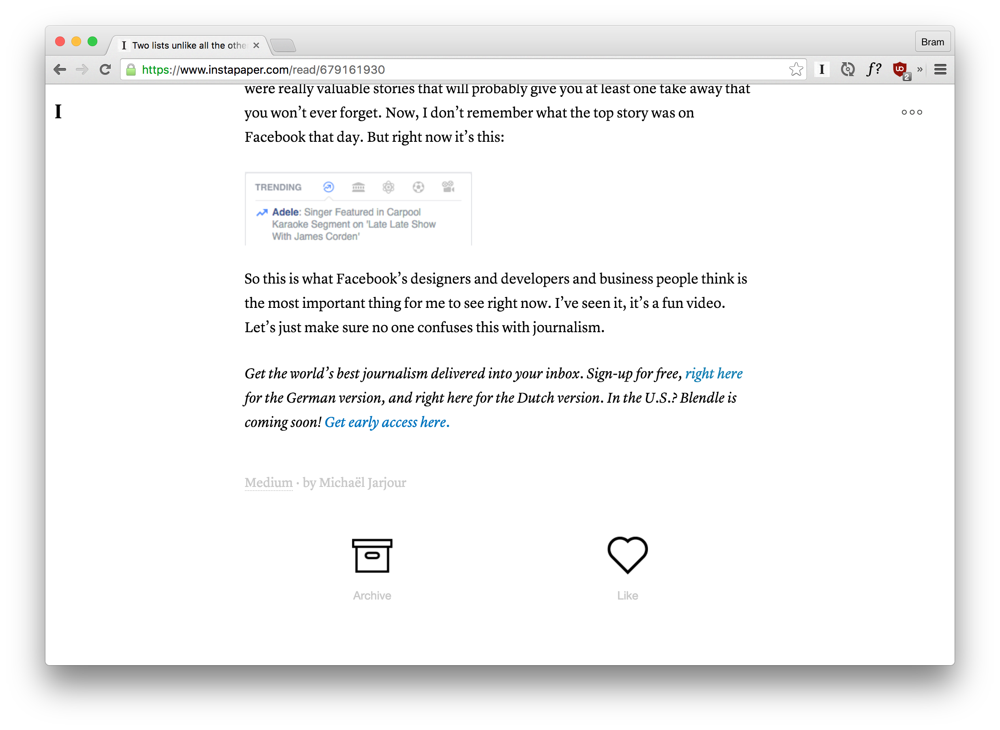

# Buttons for Instapaper

This extension adds a favorite and an archive button at the bottom of each article in Instapaper. When you've read an article, you can easily archive and/or favorite it.

## Installation

1. Download the [extension](https://github.com/bramschulting/buttons-for-instapaper/raw/master/buttons-for-instapaper.crx)
2. Go to `chrome://extensions`
3. Drag the `.crx` file into the window
4. Profit

